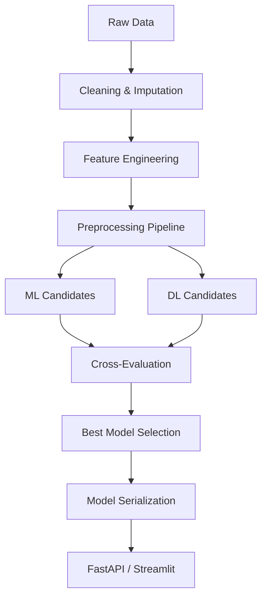

# 🎓 Student Performance Predictor

[](https://fastapi.tiangolo.com)
[](https://streamlit.io)
[](https://scikit-learn.org/)
[](https://www.python.org/)

An end-to-end production-ready Hybrid AI system designed to predict student academic performance. It integrates traditional Machine Learning (Random Forest, XGBoost) with Deep Learning (Multi-Layer Perceptrons) to achieve maximum predictive accuracy.

---

## 🚀 Project Overview

This project implements a full hybrid ML/DL lifecycle:
1.  **Exploratory Data Analysis (EDA)**: Comprehensive analysis of student factors.
2.  **Feature Engineering**: Custom transformers for academic stress and digital access.
3.  **Automated Model Selection**: Compares 6+ models (ML & DL) and picks the best performer based on RMSE.
4.  **Deep Learning Stack**: Custom Keras/TensorFlow models with early stopping and regularization.
5.  **Production API**: FastAPI serving the model with schema validation.
6.  **Analytics Dashboard**: Premium Streamlit UI with real-time synthesis and visual insights.

---

## 🧬 Hybrid Pipeline Flow



---

## 📁 Project Structure

```text
.
├── backend/                # FastAPI application
│   └── main.py             # API entry point
├── data/                   # Raw and processed datasets
├── frontend/               # UI components
│   ├── app.py              # Premium Streamlit Dashboard
│   └── index.html          # Legacy HTML/JS Frontend
├── models/                 # Serialized model artifacts (.pkl)
├── notebooks/              # Research & Development notebooks
├── scripts/                # Utility and processing scripts
├── src/                    # Core library (Feature engineering, Pipeline)
├── train.py                # Main training orchestration script
├── requirements.txt        # Unified dependency list
└── .env.example            # Environment configuration template
```

---

## 🛠️ Quick Start

### 1. Environment Setup
```bash
# Clone the repository
git clone https://github.com/louaybenmansour/projet-semestriel.git
cd projet-semestriel

# Create a virtual environment
python -m venv venv
source venv/bin/activate  # On Windows: venv\Scripts\activate

# Install dependencies
pip install -r requirements.txt
```

### 2. Train the Model
```bash
python train.py
```
*This will process data, run EDA, and save the best model to `models/model.pkl`.*

### 3. Launch the Services

**Start the Backend (API):**
```bash
uvicorn backend.main:app --reload
```

**Start the Frontend (Streamlit):**
```bash
streamlit run frontend/app.py
```

---

## 🌐 API Documentation

Once the backend is running, access the interactive documentation at:
- **Swagger UI**: [http://127.0.0.1:8000/docs](http://127.0.0.1:8000/docs)
- **ReDoc**: [http://127.0.0.1:8000/redoc](http://127.0.0.1:8000/redoc)

### Endpoint: `POST /predict`
**Payload Example:**
```json
{
  "StudyHours": 12.5,
  "SleepHours": 7.0,
  "Attendance": 92.0,
  "StressLevel": 30.0
}
```

---

## 🚢 Production Deployment

### Docker (Recommended)
A `docker-compose.yml` is provided for seamless deployment.

```bash
docker-compose up --build
```

### Streamlit Cloud
1. Push your code to GitHub.
2. Connect your repository to [Streamlit Cloud](https://share.streamlit.io/).
3. Set the `API_URL` environment variable to your deployed backend URL.

---

## 🤝 Contributors
- **Louay Ben Mansour** - [GitHub](https://github.com/louaybenmansour)

---
*Created for the Semestriel Project 2026.*
